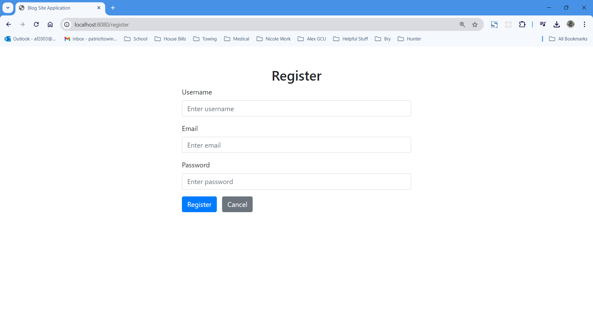
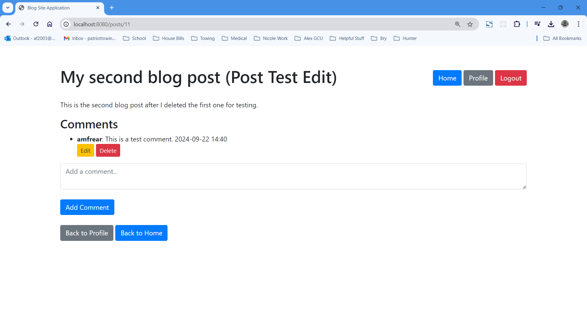
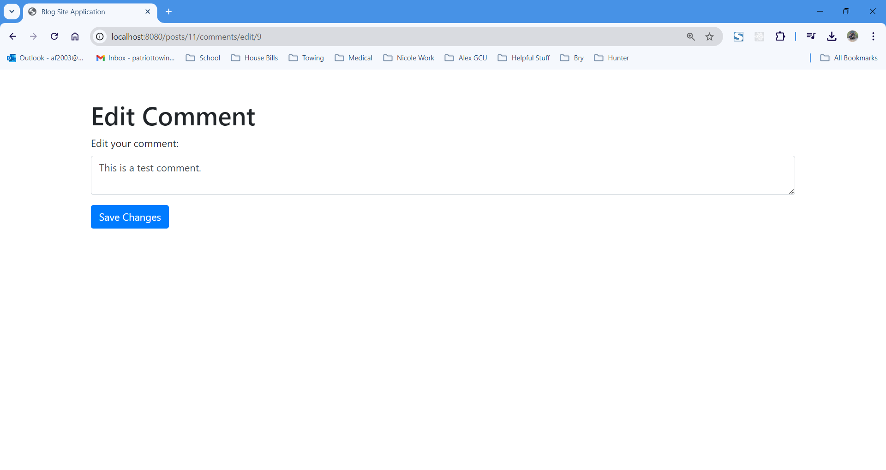
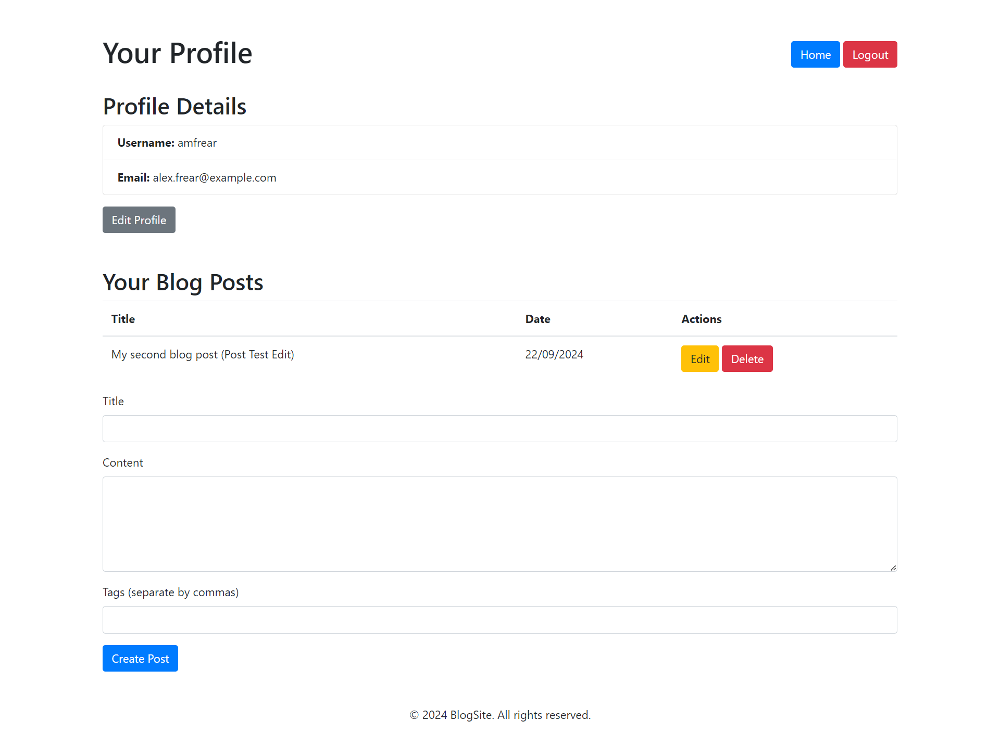
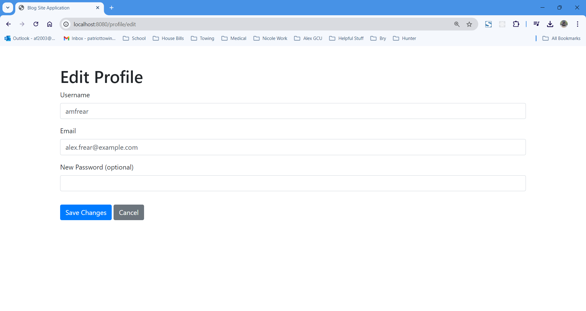
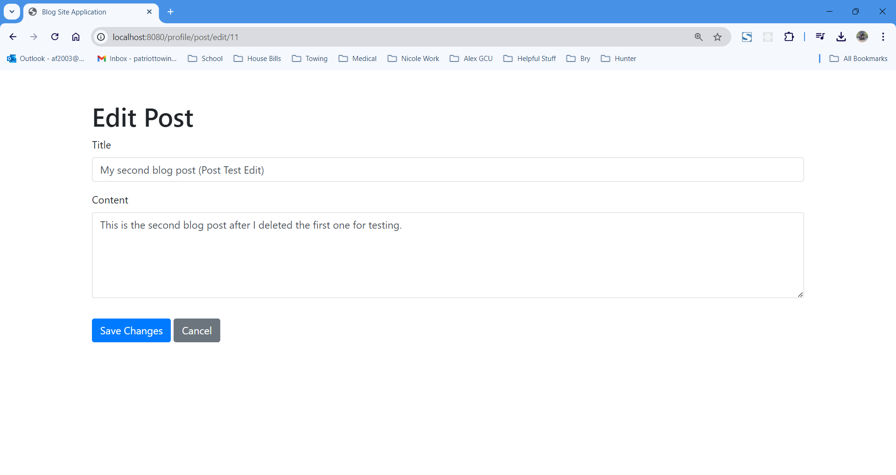
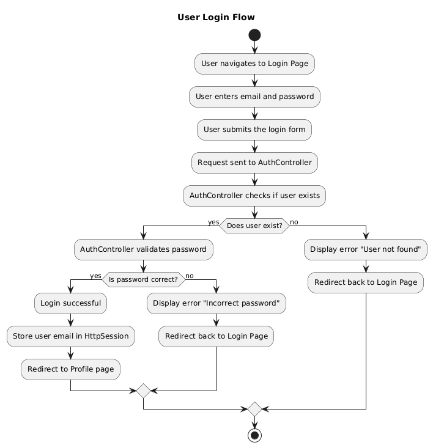

# Milestone 2: Cloud Test Application - Blog Site Application

## Cover Page
**Topic:** Milestone 2: Cloud Test Application on Laptop  
**Date:** 09/22/2024  
**Revision:** 2.0  
**Team:** Alex Frear  

---

## Weekly Team Status Summary

| **User Story**                   | **Team Member** | **Hours Worked** | **Hours Remaining** |
|----------------------------------|-----------------|------------------|---------------------|
| Project Documentation            | Alex Frear      | 2                | 0                   |
| Profile Page Development         | Alex Frear      | 4                | 0                   |
| Comment System Implementation    | Alex Frear      | 3                | 0                   |
| Frontend Integration             | Alex Frear      | 4                | 0                   |
| Post CRUD Operations             | Alex Frear      | 5                | 0                   |

---

## GIT URL and Hosting URL
**GIT URL:** https://gitlab.com/alex.frear/cst323  
**Hosting URL:** N/A (Milestone 2 is focused on local deployment) 

--- 

## Peer Review
**Peer Review:** N (I am working alone)  

---

## Design Documentation

### Install Instructions

1. Install MySQL and create the BlogSiteDB database.
2. Run the provided DDL scripts (available in the GitLab repository) to set up the schema.
3. Clone the repository from GitLab:

    ```bash
    git clone https://gitlab.com/amfrear1/cst323.git
    ```

4. Open the project in an IDE (e.g., IntelliJ IDEA or Spring Tool Suite).
5. Configure the `application.properties` file with your database credentials:

    ```properties
    spring.datasource.url=jdbc:mysql://localhost:3306/BlogSiteDB  
    spring.datasource.username=root  
    spring.datasource.password=root  
    ```

6. Run the application using the IDE.

### General Technical Approach
The Blog Site Application is built using the following layers and technologies:

- **Backend:** Spring Boot, providing RESTful APIs and server-side rendering through Thymeleaf.
- **Frontend:** Thymeleaf, integrated with Bootstrap for a responsive user interface.
- **Database:** MySQL for storing user information, posts, comments, and tags.
- **Tools/Frameworks:** Spring Data JPA, Hibernate for ORM, and Thymeleaf for rendering.

### Key Technical Design Decisions
- **Framework:** Spring Boot for backend development to ensure flexibility and scalability.
- **Database:** MySQL was chosen to handle relational data storage.
- **Frontend:** Thymeleaf and Bootstrap, providing simple server-side rendering and a responsive UI.
- **Cloud Provider:** Microsoft Azure (to be implemented in Milestone 3).

### Risks
**Technical Risks:**
- Ensuring smooth deployment to cloud services (future milestones).
- Integration challenges with cloud-based MySQL.

**Functional Risks:**
- Ensuring secure user authentication and data handling.
- Handling blog post and comment data efficiently.

### ER Diagram and DDL Script
The ER diagram for the database schema is provided below:


<br>

- **DDL Script:** Available in the GitLab repository 'blogsiteapp_data.sql`.

### Sitemap Diagram
The sitemap remains the same as Milestone 1. Key pages include:

- Home
- User Profile
- Post Details
- Login/Registration


### Security Design

For this Blog Site Application, user authentication is handled through a custom `AuthController`, which manages user login sessions and credentials. This approach allows for simple and efficient authentication without the complexity of Spring Security.

**Authentication Flow**:
- Users register with a unique email and password, which are stored securely in the database.
- During login, user credentials are validated by checking the email and password against stored records.
- Upon successful login, the user's email is saved in the session (`HttpSession`), which allows the application to track the currently logged-in user.
- Session data is used to identify the logged-in user across different parts of the application, ensuring that only authenticated users can access their profile, create posts, or leave comments.

**Key Features**:
- Custom `AuthController` for handling login, logout, and session management.
- Simple session-based authentication using `HttpSession`.
- Login credentials (email and password) are validated through the `UserService`.
- `HttpSession` tracks the logged-in user by storing the user's email, allowing for easy session validation in controllers and views.

**Security Considerations**:
- Passwords are stored in plain text for simplicity in this prototype. In a production environment, password hashing and additional security measures should be implemented to protect user data.
- The application relies on session management via `HttpSession`, which is a simple and effective solution for small applications. However, token-based authentication (such as JWT) would be recommended for larger-scale or cloud-deployed applications.

### User Interface Diagrams
Wireframes for key pages like the Home page, Profile page, and Post Details have been updated. 
<br>

**Login Page:**


**Registration Page:**



**Home Page:**


**Post Details Page:**



**Edit Comment Page:**



**Profile Page:**



**Edit Profile Page:**



**Edit Post Page:**



### UML Class Diagram


---

## URL of Git Repository
**GIT URL:** https://gitlab.com/amfrear1/cst323/-/tree/main/BlogSiteApp?ref_type=heads

---

## URL of Screencast
**Screencast:**
<div>
    <a href="https://www.loom.com/share/adbfd8b8c1a14675a1769abb35e3d283">
      <p>CST323 - Milestone2 - BlogSiteApp Local - Watch Video</p>
    </a>
    <a href="https://www.loom.com/share/adbfd8b8c1a14675a1769abb35e3d283">
      
    </a>
</div>
  
---

## Continuous Integration and Continuous Deployment (CI/CD)
GitLab CI/CD pipelines are used to manage local build and testing automation. Cloud-based CI/CD will be integrated in later milestones for deployment to AWS.

---

## Third Party Interface Design
N/A (No third-party API is integrated into the project at this stage. This will be explored in future iterations or milestones).

---

## Flowcharts
Flowcharts for key processes like post creation and user login flow have been added. See below:

**Post Creation Flowchart:**


**User Login Flowchart:**



---

## Pseudo Code

### 1. User Login Process

```java
Function loginUser(email, password):
    user = findUserByEmail(email)
    
    If user is found:
        If user.password matches the input password:
            Set user session to logged-in
            Redirect to Profile Page
        Else:
            Display "Incorrect password" error
            Redirect back to Login Page
    Else:
        Display "User not found" error
        Redirect back to Login Page
```

### 2. Create Post Process

```java
Function createPost(title, content, userId):
    If title and content are not empty:
        post = Create new Post with title, content, and userId
        Save post to database
        Redirect user to Profile Page with success message
    Else:
        Display error "Title and content cannot be empty"
        Redirect back to Create Post Page
```

### 3. Comment on Post Process

```java
Function addComment(postId, userId, commentContent):
    If commentContent is not empty:
        comment = Create new Comment with postId, userId, and commentContent
        Save comment to database
        Redirect to Post Details Page
    Else:
        Display error "Comment cannot be empty"
        Redirect back to Post Details Page
```

### 4. User Registration Process

```java
Function registerUser(username, email, password):
    If email does not already exist:
        If password is strong enough:
            Create new User with username, email, and password
            Save user to database
            Set user session to logged-in
            Redirect to Profile Page
        Else:
            Display "Password is too weak" error
            Redirect back to Registration Page
    Else:
        Display "Email already in use" error
        Redirect back to Registration Page
```
---

## Other Documentation
- **Final Cloud Provider Decision:** Microsoft Azure
- **User Stories for Milestone 2:** Completed user registration, profile management, blog post creation, editing, and comment management locally.
