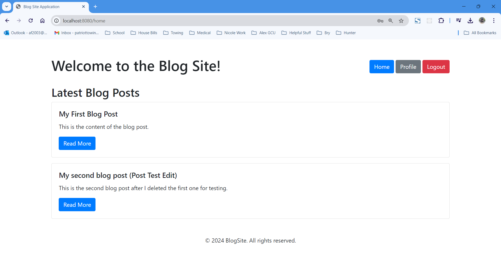

# Milestone 3: Cloud Test Application - Blog Site Application on Azure

## Cover Page
**Topic:** Milestone 3: Cloud Test Application on Azure  
**Date:** 09/29/2024  
**Revision:** 3.0  
**Team:** Alex Frear  

---

## Weekly Team Status Summary

| **User Story**                   | **Team Member** | **Hours Worked** | **Hours Remaining** |
|----------------------------------|-----------------|------------------|---------------------|
| Azure Database Setup             | Alex Frear      | 2                | 0                   |
| Azure App Services Deployment    | Alex Frear      | 3                | 0                   |
| Application Configuration        | Alex Frear      | 2                | 0                   |
| Azure Cloud Testing              | Alex Frear      | 2                | 0                   |
| CRUD Operations Verification     | Alex Frear      | 2                | 0                   |

---

## GIT URL and Hosting URL
**GIT URL:** https://gitlab.com/amfrear1/cst323  
**Hosting URL:** https://blogsiteapp-chfubvaecdh9ekej.canadacentral-01.azurewebsites.net/login  

---

## Peer Review
**Peer Review:** N (I am working alone)  

---

## Deployment Documentation

### Install Instructions

1. **Create Azure Database:**
   - Log into Azure Portal and create a MySQL Database.
   - Configure server settings (username, password, etc.) and note the connection string details.

2. **Connect to MySQL Workbench:**
   - Use the connection string provided by Azure to connect MySQL Workbench to the Azure database.
   - Create and import the required tables for the Blog Site Application.

3. **Modify `application.properties`:**
   - Update the application’s `application.properties` file with the Azure MySQL connection details:
     ```properties
     spring.datasource.url=jdbc:mysql://[Azure Server Name]:3306/[Database Name]
     spring.datasource.username=[Azure Username]
     spring.datasource.password=[Azure Password]
     ```
   - Test the connection locally by running the application through your IDE (e.g., IntelliJ IDEA, Spring Tool Suite).

4. **Deploy to Azure App Services:**
   - In Azure Portal, create an App Service for the Spring Boot Application.
   - Use Advanced Tools (Kudu) to navigate to the site/wwwroot directory.
   - Upload the `.jar` file of the application to the directory.
   - Restart the deployment and verify that the application is running correctly.

5. **Test CRUD Operations:**
   - After deployment, test all CRUD operations on the live site to ensure they are functioning as expected.

---

## Technical Design Decisions
- **Framework & Backend:** Spring Boot, providing RESTful APIs and server-side rendering through Thymeleaf.
- **Frontend:** Thymeleaf, with Bootstrap for a responsive user interface.
- **Database:** Azure MySQL Database.
- **Cloud Provider:** Microsoft Azure using App Services for hosting and deployment.
- **CI/CD Pipeline:** GitLab CI/CD pipelines are used to manage local build and testing automation. Cloud-based CI/CD for deployment to Azure.

---

## Design Documentation
- **ER Diagram and DDL Script:** 

  
	
- **DDL Script:** Available in the GitLab repository 'blogsiteapp_data.sql`.

<br>

- **Sitemap Diagram:** The sitemap remains consistent from Milestone 2, detailing key pages like Home, Profile, Post Details, and Login/Registration. 

---

## Security Design
For this Blog Site Application, user authentication is handled through a custom `AuthController`, which manages user login sessions and credentials. This approach allows for simple and efficient authentication without the complexity of Spring Security.

**Authentication Flow**:
- Users register with a unique email and password, which are stored securely in the database.
- During login, user credentials are validated by checking the email and password against stored records.
- Upon successful login, the user's email is saved in the session (`HttpSession`), which allows the application to track the currently logged-in user.
- Session data is used to identify the logged-in user across different parts of the application, ensuring that only authenticated users can access their profile, create posts, or leave comments.

**Key Features**:
- Custom `AuthController` for handling login, logout, and session management.
- Simple session-based authentication using `HttpSession`.
- Login credentials (email and password) are validated through the `UserService`.
- `HttpSession` tracks the logged-in user by storing the user's email, allowing for easy session validation in controllers and views.

**Security Considerations**:
- Passwords are stored in plain text for simplicity in this prototype. In a production environment, password hashing and additional security measures should be implemented to protect user data.
- The application relies on session management via `HttpSession`, which is a simple and effective solution for small applications. However, token-based authentication (such as JWT) would be recommended for larger-scale or cloud-deployed applications.

---

### User Interface Diagrams
Wireframes for key pages like the Home page, Profile page, and Post Details have been updated. 
<br>

**Login Page:**


**Registration Page:**


**Home Page:**



**Post Details Page:**


**Edit Comment Page:**


**Profile Page:**


**Edit Profile Page:**


**Edit Post Page:**


---

### UML Class Diagram


---

## Flowcharts
- **Post Creation Flowchart:** 


- **User Login Flowchart:** 


---

## Screencast of Deployment
**Screencast:** 
<div>
    <a href="https://www.loom.com/share/e34de5b96fc74fe6a4e6fe967e741fa5">
      <p>CST 323 - Milestone 3 - Cloud Deployment - Watch Video</p>
    </a>
    <a href="https://www.loom.com/share/e34de5b96fc74fe6a4e6fe967e741fa5">
      
    </a>
  </div>

---

## Pseudo Code

### 1. User Login Process

```java
Function loginUser(email, password):
    user = findUserByEmail(email)
    
    If user is found:
        If user.password matches the input password:
            Set user session to logged-in
            Redirect to Profile Page
        Else:
            Display "Incorrect password" error
            Redirect back to Login Page
    Else:
        Display "User not found" error
        Redirect back to Login Page
```

### 2. Create Post Process

```java
Function createPost(title, content, userId):
    If title and content are not empty:
        post = Create new Post with title, content, and userId
        Save post to database
        Redirect user to Profile Page with success message
    Else:
        Display error "Title and content cannot be empty"
        Redirect back to Create Post Page
```

### 3. Comment on Post Process

```java
Function addComment(postId, userId, commentContent):
    If commentContent is not empty:
        comment = Create new Comment with postId, userId, and commentContent
        Save comment to database
        Redirect to Post Details Page
    Else:
        Display error "Comment cannot be empty"
        Redirect back to Post Details Page
```

### 4. User Registration Process

```java
Function registerUser(username, email, password):
    If email does not already exist:
        If password is strong enough:
            Create new User with username, email, and password
            Save user to database
            Set user session to logged-in
            Redirect to Profile Page
        Else:
            Display "Password is too weak" error
            Redirect back to Registration Page
    Else:
        Display "Email already in use" error
        Redirect back to Registration Page
```
---

## Additional Notes
- **Testing:** CRUD operations were thoroughly tested after deployment to ensure they work correctly on the Azure environment.
- **Challenges Faced:** Configuring the Azure database connection and deploying the `.jar` file via Kudu were key steps in the successful deployment process.
